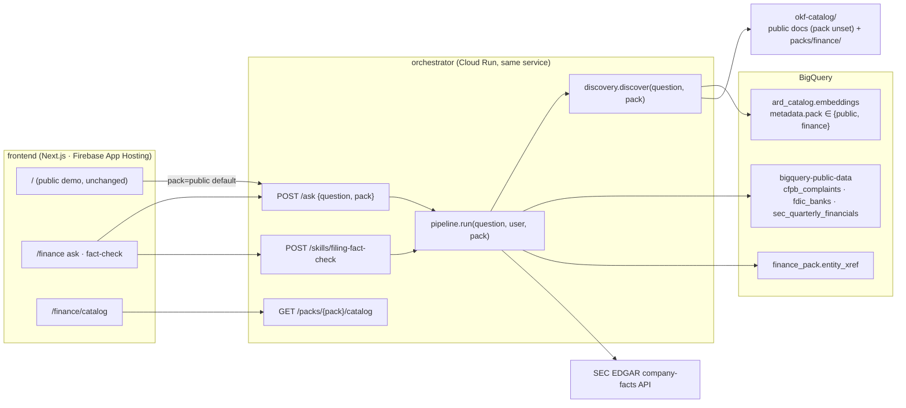

# Atlas Finance Pack: Engineering Design

For review · 3 September 2026 · Scope: phases 0–2 of `atlas-finance-demo-plan.md` (use cases A and B) as a separate section of atlasdata.world that leaves the existing public demo untouched.

---

## 0. Design in one paragraph

The finance section is a **pack**: a named slice of the catalog (`pack: finance`) that the crawler, the OKF loader, discovery and the `/ask` endpoint all understand. The existing demo is the `public` pack and is the default everywhere, so every current request, every current OKF document and every current crawled row behaves exactly as today. The frontend gets a `/finance` route family that reuses the same components (`Header`, `SignInGate`, `AskBar`, `TracePanel`, `AnswerCanvas`, `Walkthrough`) with the pack passed through, plus two finance-only additions: a **receipt** card (template version, reviewer, freshness, bytes, tokens, cost) and a **fact-check** mode that renders a verdict table. Everything ships behind two flags (`ATLAS_PACKS_ENABLED` on the backend, `NEXT_PUBLIC_ATLAS_FINANCE_ENABLED` on the frontend), so the branch can merge and deploy in either order without changing what a visitor to `/` sees.

---

## 1. Goals and non-goals

**Goals.** Use case A (complaint and conduct intelligence) and use case B (filing-grounded fact-check and peer benchmark) working end to end at `atlasdata.world/finance`; the same look, sign-in gate, trace and walkthrough as the public demo; every finance answer carrying a receipt; the public demo provably unaffected (its golden questions still route to the same sources).

**Non-goals for phases 0–2.** Optional showpiece C (AML), Kaggle loads (Home Credit, IBM AML: not needed by A or B), the deterministic attester and per-agent budgets (phase 3), the MCP surface (phase 4), in-warehouse `AI.GENERATE` (see decision D3), a separate Cloud Run service (see D1).

---

## 2. Isolation model

| Layer | Mechanism | Public demo impact |
|---|---|---|
| OKF documents | New optional frontmatter field `pack`. Docs without it are `public`. Finance docs live under `okf-catalog/packs/finance/` and declare `pack: finance`. | None: loader default is `public`. |
| Crawler | `CRAWL_TARGETS` entries become `(project, dataset, pack)`; existing 14 stay `public`. Metadata JSON gains `pack`. `--pack finance` crawls one pack; `--prune` prunes per pack. | Existing rows are rewritten with `pack: public` on the next weekly run; until then discovery treats a missing `pack` as `public`. |
| Discovery | `discover(question, pack)` pre-filters the VECTOR_SEARCH base table (`WHERE COALESCE(JSON_VALUE(metadata,'$.pack'),'public') = @pack`) and filters OKF docs by `doc.pack`. | A public question can never see a finance table, and vice versa. |
| `/ask` | Body gains optional `pack` (default `public`), validated against `ATLAS_PACKS_ENABLED` (default `public`). Unknown or disabled pack → 400. | A deployed backend with the flag unset behaves exactly as today even if the frontend sends `pack: finance`. |
| Frontend | `/finance/*` routes exist only when `NEXT_PUBLIC_ATLAS_FINANCE_ENABLED=true`; Header shows the "Finance" link under the same flag. `AskBar`, `api.askStream` take an optional `pack`. | `/` renders identical markup; new props all default to current behaviour. |
| Budget | Same per-user monthly ceiling; usage docs gain a `by_pack` breakdown for the admin console. | Same ceiling as today. |

Deploy order that keeps the site whole at every step: backend with `ATLAS_PACKS_ENABLED=public` (no behaviour change) → crawler `--pack finance` → backend flag `public,finance` → frontend flag on. Rollback is flipping either flag.

---

## 3. Backend design

### 3.1 Pack plumbing

- `okf_loader.OKFDocument` gains `pack: str = "public"` and the OKF v0.2 governance fields: `reviewer`, `reviewed_on`, `stale_after`, `lifecycle` (`draft | active | deprecated`), `version`, `cost_profile` (`{expected_bytes, cap_bytes}`), `sources` (list, for multi-source computations), `citation_template`. `load_all(pack=None)` filters.
- `discovery.discover(question, pack="public")`; VECTOR_SEARCH base table becomes a filtered subquery (BigQuery supports a pre-filtered base table).
- `pipeline.run(question, user_id, pack="public")` passes the pack to discovery and stamps it into the walkthrough and every trace event's data (`"pack": "finance"`), so the frontend trace can label it and the admin console can attribute cost.
- `main.py`: `/ask` reads `pack`; new `GET /packs/{pack}/catalog` (approved users) returns crawled tables (from `ard_catalog.embeddings` metadata) plus OKF docs for the pack, each with `trust`, `type`, `reviewer`, `reviewed_on`, `stale_after`, `lifecycle`, `row_count`, `size_gb`. Cached in-process for five minutes.

### 3.2 New candidate kinds in `_fetch_one`

Today: `bigquery` table (ad-hoc SQL), `bigquery` + `AttestedComputation` (template), `sec_edgar`. Two new kinds, both declared in the OKF `computation.runtime.executor`:

**`bigquery_sample_llm`** (use case A, narrative theming). Step 1 runs the template's SQL as a guarded, parameterised query returning at most `sample_n` rows (`complaint_id`, `date_received`, `product`, `issue`, `consumer_complaint_narrative`) with `TABLESAMPLE` / `RAND()` ordering and a hard `LIMIT`. Step 2 calls the plan-tier Gemini model with the sampled narratives and a fixed prompt from the OKF doc (`computation.runtime.prompt`) returning `{themes: [{name, share, summary, quotes: [{complaint_id, excerpt}]}]}` under a response schema. The `check` stage verifies every quoted `complaint_id` exists in the sample and every excerpt is a substring of that row's narrative; unverifiable quotes are dropped and counted in the trace. Rows handed to synthesis are the theme table, not the raw narratives. Generation tokens are recorded under `token_usage.theme` and priced with the plan-tier rates in `record_usage`.

**`composite`** (use case B, reconciliation). The OKF doc declares ordered `steps`, each a reference to another attested computation plus a parameter mapping, and a `combine` rule. `ac.sec_fact_reconcile` runs `ac.sec_fact_from_bq` and `ac.sec_edgar_company_metric_by_year` with the same `{company, metric, fiscal_year}`, then emits one row per source plus a `delta` and `agreement` column. Each step emits its own `fetch.progress` event with `step`, `sql` or `api`, `bytes_billed`, so the walkthrough shows both queries. `queries_executed` gets one entry per step.

### 3.3 Entity crosswalk

`atlas-ard-okf.finance_pack.entity_xref` (`display_name, cfpb_company_name, fdic_cert, cik, ticker, aliases ARRAY<STRING>, reviewed_on`) seeded from `okf-catalog/packs/finance/entity_xref.csv` by `infra/finance/setup.sql` + `bq load`. `ac.entity_resolve` is a small template every A2/A3/B computation reuses as a CTE; the planner never free-text-matches a bank name. Ambiguity (two rows match) is returned as a `check.done {ok:false, reason:"ambiguous_entity"}` and an honest answer listing the candidates. Initial seed: top 50 banks by FDIC deposits plus 20 large SEC filers, with the CFPB name variants observed in the data.

### 3.4 Attested computations to author

Use case A, on `bigquery-public-data.cfpb_complaints.complaint_database` (schema known):

| id | Parameters | Shape of the SQL |
|---|---|---|
| `ac.cfpb_complaints_trend` | `product?`, `company?`, `date_from`, `date_to`, `grain` (`month|quarter|year`) | `DATE_TRUNC(date_received, grain)`, counts, `COUNTIF(consumer_disputed='Yes')`, `COUNTIF(timely_response='Yes')` shares |
| `ac.cfpb_timely_response_rate` | `company`, `product?`, `peer_n`, `date_from`, `date_to` | resolves company via `entity_xref`; peer set = top `peer_n` FDIC institutions by `total_deposits` joined through the xref; quarterly timely and relief rates for the company and the peer aggregate |
| `ac.cfpb_complaint_rate_per_deposits` | `year`, `top_n` | complaints per company for the year ÷ `total_deposits` from `fdic_banks.institutions` (active rows) × 1e9 |
| `ac.cfpb_outcome_gap_by_tag` | `tag` (`Older American|Servicemember`), `product?`, `year` | outcome mix (`company_response_to_consumer`) for tagged vs untagged, with counts and a gap column |
| `ac.cfpb_narrative_themes` | `product`, `issue?`, `date_from`, `date_to`, `sample_n ≤ 500` | executor `bigquery_sample_llm`, see 3.2; requires `consumer_consent_provided='Consent provided'` |

Use case B:

| id | Parameters | Source |
|---|---|---|
| `ac.sec_edgar_company_metric_by_year` (existing, extended) | `company`, `metric`, `fiscal_year?` | EDGAR API; `CURATED_METRICS` grows to ~20 keys (deposits, loans, net interest income, provision for credit losses, stockholders' equity, dividends, interest expense, noninterest expense, cash flow from operations, capex…), same ordered-fallback pattern already used for `revenue` |
| `ac.sec_fact_from_bq` | `company`, `metric`, `fiscal_year` | `sec_quarterly_financials`: join `submission` (`adsh, cik, name, fy, fp, form, filed`) to `numbers` (`adsh, tag, ddate, qtrs, uom, value`); annual fact = `form IN ('10-K','10-K/A')`, `qtrs = 4` for duration tags or `qtrs = 0` for instant tags, latest `filed` per `fy`, `uom = 'USD'`; the same metric→tag map as the API, shared from one Python module so the two paths cannot drift. **Column names are confirmed by the crawler in phase 0 before this is authored.** |
| `ac.sec_fact_reconcile` | `company`, `metric`, `fiscal_year` | composite of the two above; output rows: `source, value, accession, filed, delta_pct, agreement` |
| `ac.sec_ratio_by_year` | `company`, `ratio` (`roa|roe|net_margin|efficiency`), `fiscal_year` | numerator/denominator tags documented per ratio; average-assets uses two year-end instants and says so |
| `ac.fdic_peer_ratios` | `measure` (`total_deposits|total_assets`), `top_n`, `as_of?` | `fdic_banks.institutions` active rows, `return_on_assets`, `return_on_equity`, `equity_capital/total_assets` |
| `ac.entity_resolve` | `name_or_ticker` | xref lookup, returns all matches |

Every document carries `pack: finance`, `trust: human-reviewed`, `reviewer`, `reviewed_on`, `stale_after`, `version`, `cost_profile` and a `citation_template`.

### 3.5 Fact-check endpoint (use case B4)

`POST /skills/filing-fact-check {text, pack:"finance"}` streams the same SSE vocabulary plus `claim.extracted` (`claims: [{id, entity, metric, period, claimed_value, comparison}]`) and `claim.verdict` per claim. Implementation: one plan-tier call extracts claims under a response schema; each claim is bound to `ac.sec_fact_reconcile` or `ac.sec_ratio_by_year` via the same planner (single-candidate mode), executed through `pipeline`'s fetch path with budget accounting; a claim with no attested path gets verdict `not_verifiable`. Terminal `answer` has `visualization.kind = "verdict_table"` with rows `{claim, entity, metric, period, claimed, reported, source, accession, verdict}` and the usual `walkthrough`. No ad-hoc SQL is ever drafted in this mode.

### 3.6 Trace and receipt

New event data fields (additive, all optional in the frontend types): `pack` on every event; `fetch.progress.step` for composite and sample-then-theme steps; `check.done.verified_quotes / dropped_quotes`; `synthesize.done.generation_cost_usd`. The terminal `answer` gains `receipt`: `{template_id, version, reviewer, reviewed_on, stale_after, stale: bool, trust, sources: [{id, kind, accession?}], bytes_billed, tokens: {plan, theme?, synthesize}, cost}` assembled in `pipeline.run` from the OKF doc and the walkthrough. The walkthrough itself is unchanged in shape.

### 3.7 Guardrails

No new limits. `record_usage` accepts an optional `extra_usage: dict[str, TokenUsage]` and prices `theme` at plan-tier rates; the Firestore usage doc gains `by_pack.{pack}.estimated_cost_usd`. `sample_n` on the theming template is clamped server-side to 500 regardless of what the planner extracts.

### 3.8 Planner and synthesis prompts

Pack-aware additions only: when `pack == "finance"` the planner prompt appends a short glossary (fiscal year vs calendar year, "uphold" = relief outcomes, ROA definitions differ by source) and the instruction that a fact-check never uses ad-hoc SQL. Synthesis gets one added rule: name the metric definition and source in the first sentence ("Using FDIC-reported return on assets…"), which the commercial proposal's hardening list already asked for. The public pack's prompts are byte-for-byte unchanged.

### 3.9 Crawler

`targets.py`: `CRAWL_TARGETS: list[tuple[str, str, str]]` with the finance rows `("bigquery-public-data","cfpb_complaints","finance")`, `("bigquery-public-data","fdic_banks","finance")` (falls back to `fdic` if `INFORMATION_SCHEMA` 404s), `("bigquery-public-data","sec_quarterly_financials","finance")`, `("bigquery-public-data","sec_failure_to_deliver","finance")`, and the existing `bls` dataset additionally tagged into finance via a `packs: ["public","finance"]` list (one row per pack, doc_id suffixed with the pack). Cloud Build config `infra/cloudbuild-crawler.yaml` gets a `_PACK` substitution.

### 3.10 Tests

- Unit (run locally, no GCP): OKF loader parses every finance doc and the governance fields; each attested SQL passes a syntax check via `sqlglot` (BigQuery dialect) and binds every declared parameter; composite step graph resolves; quote verification drops fabricated excerpts; pack filter logic; `CURATED_METRICS` keys all documented in the OKF doc.
- Golden (needs a deployed backend and a Firebase token): `tests/golden/finance_a.yaml`, `finance_b.yaml`, `public_regression.yaml` (the nine current suggestion chips). Runner `scripts/golden_run.py` posts each question, records the trace, asserts path (attested vs ad-hoc), source id, bytes under cap, non-empty citations, refusal where expected, and writes a markdown report. The public regression file is the "did not interfere" proof.

---

## 4. Frontend design

### 4.1 Routes

| Route | Purpose | Gate |
|---|---|---|
| `/finance` | Ask experience for the finance pack: pack banner, ask bar, example chips grouped A / B, trace, answer, receipt, walkthrough. A segmented control switches between **Ask** and **Fact-check** (textarea for a paragraph). | `SignInGate`, same approval as `/` |
| `/finance/catalog` | The pack's sources: table of crawled tables and attested computations with trust, reviewer, freshness, size; click expands the OKF doc body (rendered markdown) and the SQL text. | `SignInGate` |
| `/finance/design` | This document, rendered like `/implementation` (mirrored into `frontend/public/`). | none |

All under `app/finance/` with a shared `layout.tsx` that renders `Header` and a thin pack banner; `notFound()` when the flag is off.

### 4.2 Component changes

| Component | Change | Default keeps `/` identical |
|---|---|---|
| `lib/api.ts` | `askStream(question, token, opts?: {pack?, signal?})`; `factCheckStream(text, token)`; `getPackCatalog(pack, token)` | `pack` omitted → body without `pack` |
| `lib/types.ts` | `pack?` on `TraceEvent.data` and `Walkthrough`; `Receipt`; `VisualizationKind` adds `verdict_table`; new event names `claim.extracted`, `claim.verdict`; `CatalogEntry` | additive |
| `AskBar` | props `pack?`, `examples?`, `placeholder?`, `groupedExamples?` (label → questions) | defaults to today's `EXAMPLES` |
| `TracePanel` | renders `fetch.progress.step` and `claim.*` events; unknown events already fall through | additive |
| `AnswerCanvas` | new `VerdictTableViz`; existing kinds untouched | additive |
| `ReceiptCard` (new) | template, version, reviewer, reviewed on, freshness (`stale_after` with a stale badge), trust, sources with accession links, bytes, tokens by stage, cost | finance only |
| `CatalogTable` (new) | for `/finance/catalog` | finance only |
| `Header` | "Finance" link when the flag is on | hidden by default |
| `globals.css` | `.receipt`, `.chip-trust`, `.pack-banner`, `.verdict-*` classes using existing tokens | additive |

### 4.3 Visual language

No new palette or type. Finance reuses the tokens in `globals.css`: `--navy` for machine-confirmed, `--accent-2` (teal) for human-reviewed, `--accent` (amber) for "stale" and "not verifiable", `--danger` for a disagreement in a reconciliation. IBM Plex Serif for the pack title and section heads, Plex Sans body, Plex Mono for ids, SQL, accession numbers and figures. The one new visual element is the receipt: a bordered, surface-coloured block with a mono two-column label/value grid, placed between the answer and the walkthrough, because it is the artefact a model-risk reviewer keeps.

---

## 5. UX design

### 5.1 `/finance` page anatomy

1. Header (existing) with "Finance" active.
2. Pack banner: "Finance pack · 4 public sources standing in for a complaint system, an entity master and a fundamentals mart · 11 attested computations · budget $X of $100 used this month" with a link to the catalog. One line, `--ink-dim`.
3. Segmented control: **Ask** | **Fact-check**.
4. Ask: the existing ask bar; below it, two labelled rows of example chips — "Complaints & conduct" (A1–A6) and "Filings & peers" (B1–B3, B5, B6). Fact-check: a textarea pre-filled with the B4 paragraph and a "Check claims" button.
5. Trace panel (existing), now with step rows for sample → theme and for each reconciliation source.
6. Answer canvas; for fact-check, the verdict table with one row per claim: claim text, reported value, source, accession link, verdict chip (`verified` teal, `differs` danger, `not verifiable` amber).
7. Receipt card.
8. Walkthrough (existing).

### 5.2 States and copy

- Refusal (A6, B6): existing narrative "I couldn't find a data source that answers this well enough to cite…"; the receipt is omitted and the walkthrough shows the candidates considered.
- Guardrail blocked: existing red banner; the message names the cap and, when a template exists for the shape, suggests it by title ("Try the attested 'Complaint trend' computation, which is partition-pruned.").
- Ambiguous entity: "Two institutions match 'Citizens': Citizens Bank N.A. (FDIC 57957) and Citizens Bank of Edmond. Ask again with one of them."
- Stale template: amber "Reviewed 2026-09-15 · stale after 2026-12-15" badge; after the date the badge reads "Needs re-review" and the answer still runs.
- Quote verification: trace line "Verified 9 of 9 quoted narratives against the sample" (or "dropped 1 unverifiable quote").
- Fact-check verdicts: `verified` (within 0.5% of reported), `differs` (shows both and the delta), `not verifiable` (no attested computation for that claim; never guesses).

### 5.3 Catalog page anatomy

Title "Finance pack catalog"; a compact filter row (All / Attested computations / Tables); a table with columns Source, Kind, Trust, Reviewer, Reviewed, Stale after, Size; row expansion shows the description, parameters and SQL. This page is the "what stands in for what" handout from the plan, live.

---

## 6. Rollout and non-interference checks

1. Branch `finance-pack` off `main`; all work lands there; PR to `main` only after the golden public regression passes against the deployed branch backend.
2. Backend: build the orchestrator image from the branch and deploy it as a **Cloud Run revision with 0% traffic** on the existing service, tagged `finance`; the tag URL is used for testing. Flag `ATLAS_PACKS_ENABLED=public,finance` only on that revision. Promote to 100% once `public_regression.yaml` passes there.
3. Crawler: run the job once with `--pack finance`; confirm rows in `ard_catalog.embeddings` and the resolved table names; author the SEC computations against the confirmed schema.
4. Frontend: merging to `main` triggers App Hosting; with `NEXT_PUBLIC_ATLAS_FINANCE_ENABLED` unset the build is identical to today. Flip the flag in `apphosting.yaml` in a follow-up commit once the backend is promoted.
5. Rollback: flag off (frontend) or revision traffic back (backend). No data migration to undo; the finance rows in `ard_catalog.embeddings` are inert for the public pack.

---

## 7. Work breakdown for phases 0–2

| # | Work item | Files | Who can do it |
|---|---|---|---|
| 0.1 | Pack plumbing: loader fields, discovery filter, `/ask` pack, flags, walkthrough stamp | `okf_loader.py`, `discovery.py`, `pipeline.py`, `main.py`, `guardrails.py` | me, local tests |
| 0.2 | Crawler targets with packs, `--pack`, per-pack prune, Cloud Build substitution | `crawler/targets.py`, `crawler/main.py`, `infra/cloudbuild-crawler.yaml` | me |
| 0.3 | Run crawler for the finance pack; capture resolved table names and sizes | Cloud Run Job | **needs GCP (D4)** |
| 0.4 | `entity_xref` seed CSV (70 institutions) + `infra/finance/setup.sql` + load | `okf-catalog/packs/finance/entity_xref.csv`, `infra/finance/` | me (seed), GCP for load |
| 0.5 | Smoke-test three ad-hoc questions per dataset; note planner mistakes | deployed backend | needs GCP |
| 1.1 | OKF table docs for CFPB and FDIC | `okf-catalog/packs/finance/bigquery/…` | me |
| 1.2 | Five A attested computations | `okf-catalog/packs/finance/attested-computations/` | me |
| 1.3 | `bigquery_sample_llm` executor, quote verification, theme token accounting | `bigquery_accessor.py`, `pipeline.py`, `llm.py`, `guardrails.py` | me |
| 1.4 | Receipt assembly and `GET /packs/{pack}/catalog` | `pipeline.py`, `main.py` | me |
| 1.5 | Frontend: `/finance`, `/finance/catalog`, `AskBar`/`api`/`types` props, `ReceiptCard`, `CatalogTable`, Header link, flag | `frontend/app/finance/**`, `components/`, `lib/` | me, `tsc` + `next build` on the laptop |
| 1.6 | Golden sets A + public regression, runner, unit tests | `tests/`, `scripts/golden_run.py` | me (unit), GCP (golden) |
| 2.1 | `CURATED_METRICS` to ~20 keys, shared metric→tag module | `sec_edgar_accessor.py`, `backend/accessor/xbrl_metrics.py` | me |
| 2.2 | `ac.sec_fact_from_bq` against the confirmed schema | OKF doc | me, after 0.3 |
| 2.3 | `composite` executor + `ac.sec_fact_reconcile` | `pipeline.py`, OKF doc | me |
| 2.4 | `ac.sec_ratio_by_year`, `ac.fdic_peer_ratios`, `ac.entity_resolve` | OKF docs | me |
| 2.5 | Fact-check endpoint + `VerdictTableViz` + Fact-check tab | `main.py`, `backend/orchestrator/skills/filing_fact_check.py`, frontend | me |
| 2.6 | Golden set B; FinanceBench subset (30 questions) accuracy run | `tests/golden/finance_b.yaml`, `tests/financebench_subset.yaml` | me (files), GCP (run) |

---

## 8. Decisions needed before build-out

| # | Decision | Recommendation | Why it matters |
|---|---|---|---|
| D1 | Same orchestrator service with a `pack` parameter, or a second Cloud Run service for finance | **Same service**, flag-gated, 0%-traffic revision for testing | One deploy path, one budget ledger; a second service doubles infra and still shares Firestore and the catalog table |
| D2 | URL: `atlasdata.world/finance` or `finance.atlasdata.world` | **`/finance` path** | A subdomain needs a second App Hosting backend and auth-domain entry; a path reuses everything |
| D3 | Narrative theming engine: BigQuery `AI.GENERATE` in-warehouse, or guarded sample query + Gemini in the orchestrator | **Orchestrator-side for phases 1–2**; `AI.GENERATE` as a phase-3 option | `AI.GENERATE` needs a BigQuery-to-Vertex connection and separate billing; orchestrator-side reuses the existing token accounting and the byte cap on the sample. Demo moment is the same: bounded sample, verified quotes, cost line |
| D4 | How the GCP steps run (crawler job, `bq load`, Cloud Run revision, golden runs): I cannot run `gcloud`/`bq` from here or from your laptop VM | Either **you run `scripts/finance_phase0.sh` in Cloud Shell** when I hand it over, or you install `gcloud` on the laptop and sign in so I can run it through the linked session | Everything else in phases 0–2 I can build and unit-test without GCP, but 0.3, 0.4 load, 0.5, 1.6 golden, 2.6 need a real project |
| D5 | Kaggle loads (Home Credit, IBM AML) now or later | **Later** (second wave / showpiece C); A and B need only public data | Saves a GCS bucket, loads and crawl time in this pass |
| D6 | Access: finance behind the same sign-in and approval as `/` | **Same gate** | Reuses `SignInGate`; a separate allowlist can come with per-agent identities in phase 3 |
| D7 | Fact-check as a separate endpoint (`/skills/filing-fact-check`) vs a `mode` on `/ask` | **Separate endpoint** | Keeps `/ask` untouched for the public demo and makes the MCP surface in phase 4 a thin wrapper |
| D8 | Entity crosswalk seed breadth | **Top 50 banks by FDIC deposits + 20 large SEC filers** | Enough for every golden question; extending is a CSV edit |

---

## 9. Open risks specific to this design

- `sec_quarterly_financials` table and column names are assumed from the SEC FSDS documentation until the crawler confirms them; every B computation that touches BigQuery is authored after 0.3.
- `fdic_banks` vs `fdic`: the crawler tries both and records which resolved.
- Firebase App Hosting deploys `main` automatically; the frontend flag is what makes merging safe, so the flag check must be in `layout.tsx` (`notFound()`), not only in the nav.
- VECTOR_SEARCH with a filtered base subquery falls back to brute force; fine at this catalog size (a few hundred rows).
- The CFPB narrative freeze (Aug 2026) means theming questions should default their window to end at 2026-06-30 unless the question names dates.
